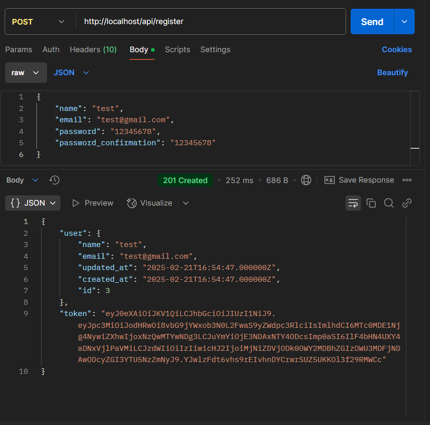
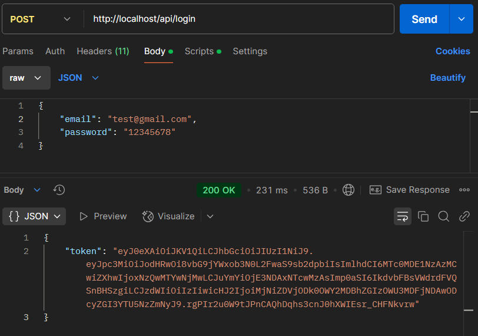
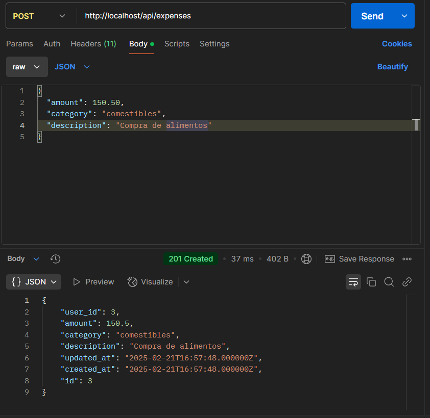
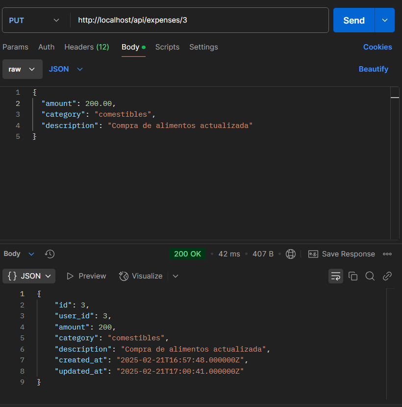
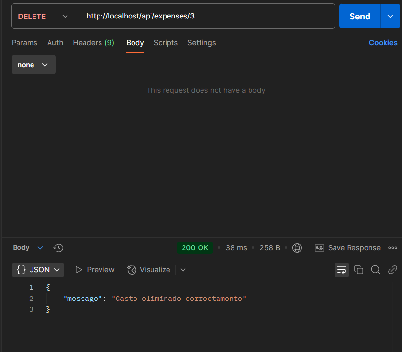

# Proyecto de Gestión de Gastos en Laravel

## Descripción
Este proyecto Laravel permite gestionar los gastos de los usuarios. Se incluyen funcionalidades de autenticación, registro de usuarios y operaciones CRUD (crear, leer, actualizar y eliminar) para los gastos.

## Requisitos
- PHP 8.2 o superior.
- Composer.
- Base de datos (por ejemplo, SQLite configurada en el archivo `.env`).
- Node.js (para la compilación de assets).

o 

- usar el comando ./vendor/bin/sail para ejecutar todos los comandos

## Instalación
1. Clona el repositorio y accede al directorio del proyecto:
   ```sh
   git clone <URL_DEL_REPOSITORIO> esta doc esta hecha en mi repo no se como la veras al entregar la tarea
   cd nombre-del-proyecto
   ```
2. Instala las dependencias de PHP:
   ```sh
   composer install o ./vendor/bin/sail composer install
   ```
3. Copia el archivo de ejemplo de variables de entorno:
   ```sh
   cp .env.example .env o simplemente borra el .example 
   ```
4. Genera la llave de la aplicación:
   ```sh
   php artisan key:generate
   ```
5. Crea la base de datos (para SQLite):
   ```sh
   touch database/database.sqlite
   ```
6. Ejecuta las migraciones:
   ```sh
   php artisan migrate o ./vendor/bin/sail php artisan migrate
   ```
7. Instala y compila los assets:
   ```sh
   npm install
   composer up -d o ./vendor/bin/sail up -d 
   npm run dev
   ```
8.  Nota todos los comandos se pueden ejecutar con ./vendor/bin/sail 

## Estructura del Proyecto

### Controladores:
- `ExpenseController`: Gestiona los gastos.
- `AuthController`: Gestiona el registro y login de usuarios.

### Modelos:
- `Expense`: Representa un gasto.
- `User`: Representa un usuario.

### Migraciones:
- `CreateExpensesTable`: Define la estructura de la tabla de gastos.
- Otras migraciones se encuentran en el directorio `database/migrations`.

### Rutas:
- Archivo `api.php` en `routes/api.php`: Define los endpoints públicos y protegidos (por ejemplo, los relacionados con gastos y autenticación).

### Pruebas:
- `ExpenseControllerTest`: Pruebas unitarias para el controlador de gastos.
- Otros tests se encuentran en la carpeta `tests`.

## Endpoints de API

- **POST** `/api/register`: Registro de usuario (implementado en `AuthController`).
- **POST** `/api/login`: Inicio de sesión.
- **GET** `/api/expenses`: Listar gastos (opcionalmente filtrando por categoría).
- **POST** `/api/expenses`: Crear un nuevo gasto.
- **GET** `/api/expenses/{id}`: Mostrar un gasto específico.
- **PUT** `/api/expenses/{id}`: Actualizar un gasto existente.
- **DELETE** `/api/expenses/{id}`: Eliminar un gasto.

## Ejecución de Pruebas
Asegúrate de tener configurado el entorno de testing (puedes crear un archivo `.env.testing`) y la base de datos correspondiente. Luego, para ejecutar las pruebas utiliza:

```sh
php artisan test
```
O directamente con PHPUnit:

```sh
vendor/bin/phpunit
```

## Endpoints de API y historia de usuario 

### 1. Registro de Usuario (POST /api/register)
**Propósito:** Crear un nuevo usuario en la aplicación.

**Cómo hacer la petición:**
- **Método:** POST
- **URL:** `http://localhost/api/register`
- **Headers:**
  - Content-Type: application/json
- **Body (JSON):**
  ```json
  {
    "name": "Nombre del Usuario",
    "email": "usuario@ejemplo.com",
    "password": "tuContraseña",
    "password_confirmation": "tuContraseña"
  }
  ```
**Lo que sucede:** El servidor valida la información, crea el usuario y genera un token JWT.



### 2. Inicio de Sesión (POST /api/login)
**Propósito:** Autenticar a un usuario existente y obtener un token JWT.

**Cómo hacer la petición:**
- **Método:** POST
- **URL:** `http://localhost/api/login`
- **Headers:**
  - Content-Type: application/json
- **Body (JSON):**
  ```json
  {
    "email": "usuario@ejemplo.com",
    "password": "tuContraseña"
  }
  ```
**Lo que sucede:** El servidor verifica las credenciales y, si son correctas, devuelve un token JWT.



### 3. Obtener la Lista de Gastos (GET /api/expenses)
**Propósito:** Recuperar todos los gastos registrados por el usuario autenticado.

**Cómo hacer la petición:**
- **Método:** GET
- **URL:** `http://localhost/api/expenses`
- **Headers:**
  - Authorization: Bearer `<tu-token>`
- **Opcional:** Se pueden enviar parámetros de consulta, por ejemplo:
  ```sh
  http://<tu-dominio-o-ip>/api/expenses?category=Comestibles
  ```
**Lo que sucede:** El servidor verifica el token JWT y devuelve los gastos del usuario.


### 4. Crear un Nuevo Gasto (POST /api/expenses)
**Propósito:** Agregar un nuevo gasto para el usuario autenticado.

**Cómo hacer la petición:**
- **Método:** POST
- **URL:** `http://localhost/api/expenses`
- **Headers:**
  - Content-Type: application/json
  - Authorization: Bearer `<tu-token>`
- **Body (JSON):**
  ```json
  {
    "amount": 150.50,
    "category": "Comestibles",
    "description": "Compra de alimentos"
  }
  ```
**Lo que sucede:** El servidor valida los datos y crea el gasto asociado al usuario.



### 5. Actualizar un Gasto Existente (PUT o PATCH /api/expenses/{id})
**Propósito:** Modificar uno o varios campos de un gasto ya registrado.

**Cómo hacer la petición:**
- **Método:** PUT o PATCH
- **URL:** `http://localhost/api/expenses/{id}`
- **Headers:**
  - Content-Type: application/json
  - Authorization: Bearer `<tu-token>`
- **Body (JSON):**
  ```json
  {
    "amount": 175.00,
    "category": "Comestibles",
    "description": "Compra de alimentos actualizada"
  }
  ```
**Lo que sucede:** El servidor verifica el gasto y lo actualiza.



### 6. Eliminar un Gasto (DELETE /api/expenses/{id})
**Propósito:** Borrar un gasto específico.

**Cómo hacer la petición:**
- **Método:** DELETE
- **URL:** `http://localhost/api/expenses/{id}`
- **Headers:**
  - Authorization: Bearer `<tu-token>`

**Lo que sucede:** El servidor verifica el token y elimina el gasto.



## Consideraciones Finales

### Token JWT
Todos los endpoints protegidos requieren incluir en la cabecera:
```sh
Authorization: Bearer <tu-token>
```

### Formato JSON
Asegúrate de configurar las peticiones con:
```sh
Content-Type: application/json
```

### URLs y Entornos
La URL base (`http://localhost` o la que aparezca la ejecutar `npm run dev`).

## ADJUNTO PAQUETE DE PRUEBAS DE POSTMAN EN EL REPO

chirper/API_base_de_gastos_Santi.json descargar y importar directamente en post-man estan preparadas para funcionar 
---

Puedes adaptar este README según tus necesidades. 🚀
